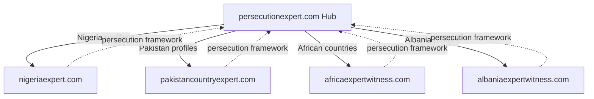
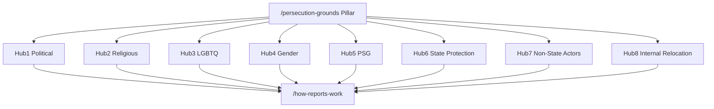
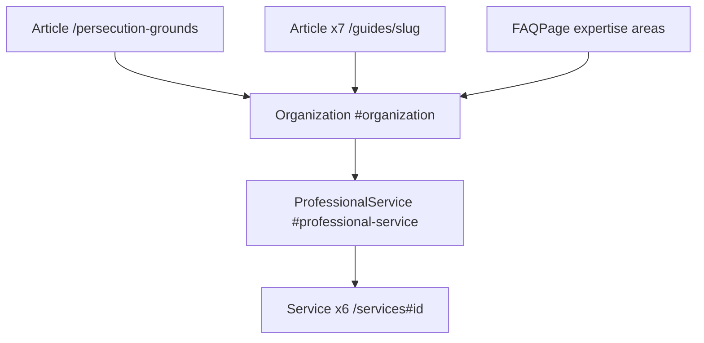

# SEO Architecture — persecutionexpert.com

**Canonical domain:** `https://www.persecutionexpert.com`  
**Site name:** Persecution Expert  
**Locale:** `en_GB` (UK immigration solicitors, tribunal practitioners, Legal Aid)  
**Role:** Thematic umbrella hub (not country-specific)

This document is the single source of truth for keyword strategy, network positioning, content clusters, internal linking, GEO (Generative Engine Optimization), off-page SEO, schema architecture, and launch deployment for persecutionexpert.com. All slugs and URLs align with the canonical build-spec naming convention.

**Implementation status:** This document reflects the **target** architecture (June 2026). The codebase is currently a Pakistan-themed clone pending migration. Slugs, metadata, internal linking matrix, glossary anchors, and sitemap inventory described here are the implementation targets. Run `npm run seo:generate && npm run seo:verify` after content or route changes.

---

## 1. Keyword Strategy

### Tier 1 — Transactional

**Target pages:** homepage, services, expertise areas, qualifications, case types, contact.

| Keyword | Primary URL |
|---------|-------------|
| persecution expert witness UK | `/` |
| persecution expert UK | `/`, `/what-is-a-persecution-expert-witness` |
| persecution expert report asylum UK | `/services`, `/how-to-instruct` |
| political persecution expert witness | `/expertise-areas/political-persecution` |
| religious persecution expert UK | `/expertise-areas/religious-persecution` |
| LGBTQ persecution expert witness UK | `/expertise-areas/lgbtq-persecution` |
| gender persecution expert report | `/expertise-areas/gender-based-persecution` |
| PSG expert witness asylum UK | `/expertise-areas/particular-social-group` |
| asylum persecution expert report UK | `/`, `/services` |
| immigration tribunal persecution expert | `/qualifications`, `/case-types/asylum-appeal-ftt` |

### Tier 2 — Informational

**Target pages:** persecution grounds pillar, expertise areas, guides, glossary, how-reports-work.

| Keyword | Primary URL |
|---------|-------------|
| what is a persecution expert witness | `/what-is-a-persecution-expert-witness` |
| persecution grounds Refugee Convention | `/persecution-grounds` |
| HJ Iran LGBTQ asylum standard | `/expertise-areas/lgbtq-persecution#hj-iran`, `/glossary#hj-iran-2010` |
| RT Zimbabwe political opinion | `/expertise-areas/political-persecution#rt-zimbabwe` |
| state protection analysis expert UK | `/expertise-areas/state-protection` |
| non-state actor persecution expert | `/expertise-areas/non-state-actors` |
| internal relocation expert analysis UK | `/expertise-areas/internal-relocation` |
| particular social group asylum expert | `/expertise-areas/particular-social-group` |
| gender based persecution asylum UK | `/expertise-areas/gender-based-persecution` |
| persecution expert report standards | `/how-reports-work`, `/qualifications` |

### Tier 3 — Long-tail

**Target pages:** expertise areas, guides, case types, country-experts network page.

| Keyword | Primary URL(s) |
|---------|----------------|
| political opinion asylum expert UK | `/expertise-areas/political-persecution`, `/guides/political-opinion-asylum-guide` |
| religious persecution conversion expert | `/expertise-areas/religious-persecution`, `/guides/religious-conversion-asylum-guide` |
| LGBTQ asylum multiple countries expert | `/expertise-areas/lgbtq-persecution`, `/country-experts` |
| FGM gender based violence expert UK | `/expertise-areas/gender-based-persecution`, `/case-types/fgm-asylum-cases` |
| PSG particular social group expert | `/expertise-areas/particular-social-group`, `/persecution-grounds#particular-social-group` |
| non-state actor persecution analysis | `/expertise-areas/non-state-actors`, `/expertise-areas/state-protection` |
| state protection failure expert report | `/expertise-areas/state-protection`, `/how-reports-work` |
| internal relocation unduly harsh expert | `/expertise-areas/internal-relocation`, `/guides/internal-relocation-asylum-guide` |
| imputed political opinion asylum UK | `/expertise-areas/political-persecution#rt-zimbabwe`, `/guides/political-opinion-asylum-guide` |
| immigration tribunal country expert | `/country-experts`, `/how-to-instruct` |

### Keyword → URL implementation reference

| Cluster | URL pattern | Meta source |
|---------|-------------|-------------|
| Brand / transactional | `/` | Page-level `createMetadata()` |
| Definition / GEO pillar | `/what-is-a-persecution-expert-witness` | Page-level metadata |
| Refugee Convention pillar | `/persecution-grounds` | Page-level metadata + section anchors |
| Expertise transactional | `/expertise-areas/{slug}` | `metaTitle`, `metaDescription`, `h1` in `data/expertise-areas.ts` |
| Case-type transactional | `/case-types/{slug}` | `data/case-types.ts` |
| Informational guides | `/guides/{slug}` | `data/guides.ts` |
| Process / standards | `/how-reports-work`, `/how-to-instruct`, `/qualifications` | Page-level metadata |
| Network hub | `/country-experts` | Page-level metadata |
| Services | `/services`, `/services/{id}` | `data/services.ts` |

**Route note:** `/what-is-a-persecution-expert-witness` is the canonical definition URL. Legacy `/what-is-a-persecution-expert-report` 301-redirects to it (see Appendix E).

---

## 2. Network Positioning

persecutionexpert.com serves as the **thematic umbrella site** for the country-specific network. It owns persecution-framework content (Refugee Convention grounds, HJ/RT standards, state protection, non-state actors, internal relocation, report standards). Country-specific profiles live on sibling sites; this hub links to them and receives reciprocal links back.



### Network sites

| Site | URL | Content role |
|------|-----|--------------|
| Nigeria Expert | [nigeriaexpert.com](https://www.nigeriaexpert.com) | Nigeria country profiles, CPIN, asylum profiles |
| Pakistan Country Expert | [pakistancountryexpert.com](https://www.pakistancountryexpert.com) | Pakistan country profiles, CPIN, asylum profiles |
| Africa Expert Witness | [africaexpertwitness.com](https://www.africaexpertwitness.com) | African country and regional expert reports |
| Albania Expert Witness | [albaniaexpertwitness.com](https://www.albaniaexpertwitness.com) | Albania country profiles and expertise areas |

### Network page

**URL:** `/country-experts` (indexable, sitemap priority 0.85)

Lists all four network sites with descriptive anchor text. Each card links externally with `rel="noopener noreferrer"`. This page targets "immigration tribunal country expert" and long-tail country-report queries while keeping country content on dedicated domains.

### Internal linking rules (network)

#### Rule A: Every thematic hub page must link to:

- `/country-experts` (with descriptive anchors: "Nigeria country expert reports", "Pakistan asylum expert reports", etc.)
- `/persecution-grounds`
- `/how-reports-work`
- `/how-to-instruct`
- `/contact`

#### Rule B: `/country-experts` must link to:

- All four network sites (external)
- `/persecution-grounds`
- Top 4 expertise areas (political, religious, LGBTQ, gender-based)
- `/how-to-instruct`

#### Rule C: Country sites (coordination, not enforced in this repo):

- Footer or sidebar link to `https://www.persecutionexpert.com/persecution-grounds`
- Contextual links from profile pages to relevant persecutionexpert.com expertise areas (e.g. Nigeria LGBTQ profile → `/expertise-areas/lgbtq-persecution`)

#### Rule D: Homepage must link to:

- Top 4 transactional expertise areas: political persecution, religious persecution, LGBTQ persecution, gender-based persecution
- `/persecution-grounds`
- `/country-experts`
- `/how-reports-work`
- `/how-to-instruct`
- `/contact`

**Enforcement:** populate `relatedLinks` in `data/related-links.ts` from [Appendix D](#appendix-d-network-outbound-link-matrix). Use descriptive anchor text (e.g. "Five Refugee Convention persecution grounds" not "click here").

**Cross-linking priority:** persecution-grounds pillar → expertise area → how-reports-work → country-experts → contact.

---

## 3. Content Clusters

Eight thematic hubs drive internal linking, anchor text, and content depth. Hub 1 (Refugee Convention grounds) is the master pillar connecting all expertise spokes.



### Hub 1: Refugee Convention grounds (master pillar)

| Role | URL |
|------|-----|
| Pillar | `/persecution-grounds` |
| Glossary | `/glossary#refugee-convention-1951`, `/glossary#refugee-convention-grounds` |
| Links to | All 8 `/expertise-areas/[slug]` pages |

**Required anchors on `/persecution-grounds`:**

| Anchor ID | Content |
|-----------|---------|
| `race` | Race ground |
| `religion` | Religion ground |
| `nationality` | Nationality ground |
| `political-opinion` | Political opinion ground |
| `particular-social-group` | PSG ground |

### Hub 2: Political persecution

| Role | URL |
|------|-----|
| Pillar | `/expertise-areas/political-persecution` |
| Guide | `/guides/political-opinion-asylum-guide` |
| Case type | `/case-types/political-opinion-asylum` |
| Glossary | `/glossary#political-opinion-asylum-ground`, `/glossary#rt-zimbabwe` |
| GEO anchor | `/expertise-areas/political-persecution#rt-zimbabwe` |

### Hub 3: Religious persecution

| Role | URL |
|------|-----|
| Pillar | `/expertise-areas/religious-persecution` |
| Guide | `/guides/religious-conversion-asylum-guide` |
| Case type | `/case-types/religious-persecution-asylum` |
| Glossary | `/glossary#religious-persecution` |

### Hub 4: LGBTQ persecution

| Role | URL |
|------|-----|
| Pillar | `/expertise-areas/lgbtq-persecution` |
| Guide | `/guides/lgbtq-asylum-evidence-guide` |
| Case type | `/case-types/lgbtq-asylum-cases` |
| Glossary | `/glossary#hj-iran-2010` |
| GEO anchor | `/expertise-areas/lgbtq-persecution#hj-iran` |

### Hub 5: Gender-based persecution

| Role | URL |
|------|-----|
| Pillar | `/expertise-areas/gender-based-persecution` |
| Guide | `/guides/fgm-gbv-asylum-guide` |
| Case type | `/case-types/fgm-asylum-cases` |
| Glossary | `/glossary#fgm-female-genital-mutilation` |

### Hub 6: Particular Social Group

| Role | URL |
|------|-----|
| Pillar | `/expertise-areas/particular-social-group` |
| Guide | `/guides/psg-asylum-guide` |
| Case type | `/case-types/psg-asylum-claims` |
| Glossary | `/glossary#particular-social-group` |

### Hub 7: State protection & non-state actors

| Role | URL |
|------|-----|
| State protection pillar | `/expertise-areas/state-protection` |
| Non-state actors pillar | `/expertise-areas/non-state-actors` |
| Guide | `/guides/state-protection-asylum-guide` |
| Glossary | `/glossary#state-protection`, `/glossary#non-state-actors` |

### Hub 8: Internal relocation

| Role | URL |
|------|-----|
| Pillar | `/expertise-areas/internal-relocation` |
| Guide | `/guides/internal-relocation-asylum-guide` |
| Case type | `/case-types/internal-relocation-challenges` |
| Glossary | `/glossary#internal-relocation` |

### Cross-cutting process hub

| Role | URL |
|------|-----|
| Report standards | `/how-reports-work` |
| Instruction | `/how-to-instruct` |
| Qualifications | `/qualifications` |
| Definition | `/what-is-a-persecution-expert-witness` |

### Internal linking matrix

#### Every `/expertise-areas/[slug]` must link to:

- `/persecution-grounds` (relevant ground anchor)
- `/how-reports-work`
- `/country-experts`
- At least 1 `/guides/[slug]` page
- At least 1 `/case-types/[slug]` page (where applicable)
- `/how-to-instruct`
- `/contact`

#### Every `/guides/[slug]` must link to:

- Relevant `/expertise-areas/[slug]` page(s)
- `/persecution-grounds`
- `/how-reports-work`
- `/how-to-instruct`
- `/contact`

#### Every `/case-types/[slug]` must link to:

- Relevant `/expertise-areas/[slug]` page(s)
- `/how-to-instruct`
- `/contact`

#### `/persecution-grounds` must link to:

- All 8 `/expertise-areas/[slug]` pages
- All 7 `/guides/[slug]` pages
- `/how-reports-work`
- `/country-experts`
- `/how-to-instruct`
- `/contact`

#### Glossary terms must link to:

- Most relevant `/expertise-areas/[slug]`
- Most relevant `/guides/[slug]`
- `/persecution-grounds` where applicable

**Enforcement:** populate `relatedLinks` in `data/related-links.ts` from [Appendix D](#appendix-d-network-outbound-link-matrix) and expertise-area minimum links matrix below.

### Expertise area minimum links matrix

| Expertise slug | Ground anchor | Guide | Case type |
|----------------|---------------|-------|-----------|
| `political-persecution` | `#political-opinion` | `political-opinion-asylum-guide` | `political-opinion-asylum` |
| `religious-persecution` | `#religion` | `religious-conversion-asylum-guide` | `religious-persecution-asylum` |
| `lgbtq-persecution` | `#particular-social-group` | `lgbtq-asylum-evidence-guide` | `lgbtq-asylum-cases` |
| `gender-based-persecution` | `#particular-social-group` | `fgm-gbv-asylum-guide` | `fgm-asylum-cases` |
| `particular-social-group` | `#particular-social-group` | `psg-asylum-guide` | `psg-asylum-claims` |
| `state-protection` | — | `state-protection-asylum-guide` | `asylum-appeal-ftt` |
| `non-state-actors` | — | `state-protection-asylum-guide` | `asylum-appeal-ftt` |
| `internal-relocation` | — | `internal-relocation-asylum-guide` | `internal-relocation-challenges` |

---

## 4. GEO Optimization Targets

Content structured for AI citation and featured snippets: definition-first, tables, numbered steps, citeable legal standards.

| # | GEO target | URL | Required extractable artifact |
|---|------------|-----|------------------------------|
| 1 | Five Refugee Convention grounds table | `/persecution-grounds` | Ground, definition, expert-report relevance table |
| 2 | State protection three-part test table | `/expertise-areas/state-protection` | Numbered test + citeable table (operation, willingness, effectiveness) |
| 3 | HJ (Iran) four-stage test explained | `/expertise-areas/lgbtq-persecution#hj-iran` | Stage-by-stage numbered list |
| 4 | RT (Zimbabwe) imputed political opinion | `/expertise-areas/political-persecution#rt-zimbabwe` | Case summary block + imputed-opinion definition |
| 5 | Non-state actor framework | `/expertise-areas/non-state-actors` | Actor types + state-protection linkage table |
| 6 | Adam Pipe guide reference | `/how-reports-work` | Checklist + Immigration Tribunal PD para 10 cross-reference |
| 7 | Expert report standards table | `/how-reports-work#report-standards` | Standards checklist table (CPR Part 35, independence, sources, methodology) |

### GEO content rules

- Lead with a direct answer paragraph (40 to 60 words) before depth.
- Tables use `<table>` with `<caption>` and header row for accessibility and parsing.
- Include source citations (OSCOLA-style) where legal standards or country guidance positions are cited.
- Avoid gating key factual content behind accordions only.

### Refugee Convention grounds table (GEO #1), required rows

| Ground | Definition (summary) | Expert report relevance |
|--------|---------------------|-------------------------|
| Race | Persecution for reasons of race | Ethnic/tribal targeting analysis |
| Religion | Persecution for reasons of religion | Conversion, apostasy, minority faith evidence |
| Nationality | Persecution for reasons of nationality | Ethnic/national identity distinct from race |
| Political opinion | Persecution for reasons of political opinion | Imputed opinion (RT Zimbabwe), activism, dissent |
| Particular Social Group | Membership of a PSG | LGBTQ (HJ Iran), gender, social visibility |

### State protection three-part test (GEO #2), required elements

| Element | Question for expert report |
|---------|---------------------------|
| Operation | Is the state apparatus functioning? |
| Willingness | Is the state willing to protect the claimant? |
| Effectiveness | Would protection be effective in the claimant's circumstances? |

### HJ (Iran) four-stage test (GEO #3), required stages

1. Is the claimant gay (or perceived as gay)?
2. Do they have to conceal their sexuality to avoid persecution?
3. Would concealment be reasonably tolerable?
4. If not, is there a real risk of persecution?

### Expert report standards table (GEO #7), required rows

| Standard | Requirement |
|----------|-------------|
| Independence | Expert's duty to the tribunal (CPR Part 35) |
| Methodology | Sources, field research, COI cited (OSCOLA) |
| Scope | Matters within expertise only |
| Structure | PD para 10 + Adam Pipe October 2025 guide |
| Conclusions | Profile-specific risk, state protection, internal relocation |

---

## 5. Off-Page SEO Targets

### Directories (listing submissions)

| Directory | URL | Target page to link |
|-----------|-----|---------------------|
| Electronic Immigration Network (EIN) | [ein.org.uk/experts](https://ein.org.uk/experts) | `/`, `/expertise-areas/*` — list as **Persecution Expert** under "expert reports" category |
| ILPA membership directory | ILPA member directory | `/qualifications`, `/how-reports-work` |
| Free Movement | [freemovement.org.uk](https://freemovement.org.uk) | `/persecution-grounds`, `/guides/*` |
| Garden Court Chambers | Linking partner — complementary practice | `/how-reports-work`, `/qualifications` |
| Asylum Aid | Outreach target | `/expertise-areas/gender-based-persecution` |
| UNHCR UK | Outreach target | `/persecution-grounds` |

**Submission tracking template:**

| Directory | Owner | Submitted | Live URL | Referral sessions/mo |
|-----------|-------|-----------|----------|----------------------|
| EIN | | | | |
| ILPA | | | | |
| Free Movement | | | | |
| Garden Court Chambers | | | | |
| Asylum Aid | | | | |
| UNHCR UK | | | | |

### Publications (citations / guest content)

| Publication | Focus |
|-------------|-------|
| Free Movement | freemovement.org.uk: asylum, Refugee Convention grounds, HJ/RT standards |
| ILPA | Immigration practitioners, tribunal practice, expert evidence |
| Legal Action Group (LAG) | Legal aid, tribunal practice |
| UK Human Rights Blog | Human rights, persecution frameworks |

**Outreach KPI template:**

| Publication | Piece title | Published | Backlink URL | Domain rating |
|-------------|-------------|-----------|--------------|---------------|
| | | | | |

### Digital PR angles

1. **Five Refugee Convention Grounds: What UK Asylum Solicitors Need from a Persecution Expert** (supports `/persecution-grounds` and GEO #1)
2. **HJ (Iran) and RT (Zimbabwe): Two Landmark Tests Every Persecution Expert Report Must Address** (Hubs 2 and 4, GEO #3 and #4)
3. **State Protection Failures in Expert Reports: The Three-Part Test Explained** (Hub 7, GEO #2)
4. **Non-State Actor Persecution: When Family, Community, or Militias Are the Perpetrators** (Hub 7, GEO #5)
5. **Adam Pipe October 2025: What Changed for Immigration Tribunal Expert Reports** (`/how-reports-work`, GEO #6 and #7)
6. **Internal Relocation and the Unduly Harsh Standard: Expert Evidence in UK Tribunals** (Hub 8)

---

## 6. Deployment Checklist

| Task | Implementation | Status |
|------|----------------|--------|
| Vercel deployment | Connect repo; production branch deploy | Pending (manual) |
| DNS: `persecutionexpert.com` → www | Registrar CNAME + `middleware.ts` apex 301 | Pending (manual) |
| `NEXT_PUBLIC_SITE_URL` / `SITE_URL` | `https://www.persecutionexpert.com` in `lib/constants.ts` | Pending |
| Contact form → Google Sheets + webhook | `/api/submit-lead` + `lib/google-sheets.ts` | Implemented (from template) |
| `GOOGLE_SITE_VERIFICATION` | `metadata.verification.google` in `app/layout.tsx` | Pending (env var) |
| `BING_SITE_VERIFICATION` | `metadata.other` in layout | Pending (env var) |
| `NEXT_PUBLIC_GA_MEASUREMENT_ID` | Analytics component (consent-gated) | Pending (env var) |
| `html lang="en-GB"` | Root layout `<html lang="en-GB">` | Target |
| `hreflang` | `en-GB`, `en-US`, `x-default` in `alternates.languages` | Target |
| Submit sitemap | GSC + Bing Webmaster: `/sitemap.xml` | Pending (post-deploy) |
| Google Search Console | Domain property for persecutionexpert.com | Pending (post-deploy) |
| LinkedIn company page | `PersecutionExpert` → `sameAs` in Organization schema | Pending |
| EIN directory submission | ein.org.uk/experts — "expert reports" category | Manual post-launch |

**Hosting migration note:** Current repo includes Netlify config (`netlify.toml`). Production deployment target is **Vercel** per this architecture. Remove or archive Netlify config during migration.

**Canonical and robots:**

- All pages: canonical via `createMetadata()` in `lib/metadata.ts`
- Staging/preview: `noindex: true` on non-production hosts
- Production: `app/robots.ts` allow `/`, point to sitemap
- Exclude from sitemap: `/contact`, `/thank-you`, `/privacy`, `/terms`, `/cookie-policy`

**Target middleware pattern:**

```ts
const PRIMARY_HOST = "www.persecutionexpert.com";
const PRIMARY_ORIGIN = "https://www.persecutionexpert.com";
const REDIRECT_HOSTS = new Set([
  "persecutionexpert.com",
]);
```

**Environment variables (all):**

| Variable | Purpose |
|----------|---------|
| `NEXT_PUBLIC_SITE_URL` | Canonical site URL |
| `GOOGLE_SERVICE_ACCOUNT_EMAIL` | Contact form → Sheets |
| `GOOGLE_PRIVATE_KEY` | Contact form → Sheets |
| `GOOGLE_SHEET_ID` | Contact form → Sheets |
| `GOOGLE_SHEET_TAB_NAME` | Contact form → Sheets |
| `Lead_notification_url` | Optional webhook notification |
| `GOOGLE_SITE_VERIFICATION` | Search Console verification |
| `BING_SITE_VERIFICATION` | Bing Webmaster verification |
| `NEXT_PUBLIC_GA_MEASUREMENT_ID` | Google Analytics 4 |
| `NEXT_PUBLIC_GTM_ID` | Google Tag Manager (optional) |
| `NEXT_PUBLIC_LINKEDIN_PARTNER_ID` | LinkedIn Insight Tag (optional) |

**Reference implementation:** `nigeria-expert/app/layout.tsx`, `nigeria-expert/lib/metadata.ts`, `africa-expert-witness/middleware.ts`

---

## Appendix A: Full URL Inventory (~40 routes)

### Static and hub pages (12 indexable)

| URL | Sitemap priority |
|-----|------------------|
| `/` | 1.0 |
| `/persecution-grounds` | 0.95 |
| `/expertise-areas` | 0.90 |
| `/services` | 0.90 |
| `/what-is-a-persecution-expert-witness` | 0.90 |
| `/how-reports-work` | 0.90 |
| `/country-experts` | 0.85 |
| `/case-types` | 0.88 |
| `/how-to-instruct` | 0.88 |
| `/qualifications` | 0.88 |
| `/guides` | 0.87 |
| `/glossary` | 0.75 |

### Redirect-only paths (not indexable pages)

| URL | Redirects to |
|-----|--------------|
| `/what-is-a-persecution-expert-report` | `/what-is-a-persecution-expert-witness` |
| `/fees` | `/how-to-instruct` |
| `/faq` | `/guides` |
| `/experts` | `/qualifications` |

### Dynamic pages (28)

| Pattern | Count | Sitemap priority |
|---------|-------|------------------|
| `/expertise-areas/{slug}` | 8 | 0.90–0.92 |
| `/case-types/{slug}` | 7 | 0.88 |
| `/guides/{slug}` | 7 | 0.82 |
| `/services/{id}` | 6 | 0.90 |

### Legal / utility (noindex or excluded)

| URL | Robots |
|-----|--------|
| `/contact` | Excluded from sitemap |
| `/privacy` | noindex, follow |
| `/terms` | noindex, follow |
| `/cookie-policy` | noindex, follow |
| `/thank-you` | noindex, nofollow |

**Total indexable URLs:** ~40 (excluding `/contact`, `/thank-you`, `/privacy`, `/terms`, `/cookie-policy`).

### Expertise area slugs (8)

`political-persecution`, `religious-persecution`, `lgbtq-persecution`, `gender-based-persecution`, `particular-social-group`, `state-protection`, `non-state-actors`, `internal-relocation`

### Guide slugs (7)

`political-opinion-asylum-guide`, `religious-conversion-asylum-guide`, `lgbtq-asylum-evidence-guide`, `fgm-gbv-asylum-guide`, `psg-asylum-guide`, `state-protection-asylum-guide`, `internal-relocation-asylum-guide`

### Case type slugs (7)

`asylum-appeal-ftt`, `political-opinion-asylum`, `religious-persecution-asylum`, `lgbtq-asylum-cases`, `fgm-asylum-cases`, `psg-asylum-claims`, `internal-relocation-challenges`

---

## Appendix B: Sitemap Priorities

| Route family | Priority |
|--------------|----------|
| `/` | 1.0 |
| `/persecution-grounds` | 0.95 |
| `/expertise-areas/political-persecution` | 0.92 |
| `/expertise-areas/lgbtq-persecution` | 0.92 |
| `/expertise-areas/[other slug]` | 0.90 |
| `/services`, `/what-is-a-persecution-expert-witness`, `/how-reports-work` | 0.90 |
| `/services/{id}` | 0.90 |
| `/country-experts` | 0.85 |
| `/case-types` (hub), `/case-types/[slug]` | 0.88 |
| `/how-to-instruct`, `/qualifications` | 0.88 |
| `/guides` (hub) | 0.87 |
| `/guides/[slug]` | 0.82 |
| `/glossary` | 0.75 |

**Priority boost for highest-volume expertise areas:**

- `/expertise-areas/political-persecution`: top transactional spoke (Hub 2)
- `/expertise-areas/lgbtq-persecution`: second priority (Hub 4, HJ Iran GEO)

---

## Appendix C: Required Glossary Anchor IDs

| Term | Anchor ID |
|------|-----------|
| Refugee Convention 1951 | `refugee-convention-1951` |
| Refugee Convention grounds | `refugee-convention-grounds` |
| HJ (Iran) [2010] | `hj-iran-2010` |
| RT (Zimbabwe) [2008] | `rt-zimbabwe` |
| State Protection | `state-protection` |
| Non-State Actors | `non-state-actors` |
| Internal Relocation | `internal-relocation` |
| Particular Social Group (PSG) | `particular-social-group` |
| Political Opinion (asylum ground) | `political-opinion-asylum-ground` |
| Religious Persecution | `religious-persecution` |
| Persecution | `persecution` |
| Well-Founded Fear | `well-founded-fear` |
| CPR Part 35 | `cpr-part-35` |
| OSCOLA Citation Standard | `oscola-citation-standard` |
| FGM (Female Genital Mutilation) | `fgm-female-genital-mutilation` |
| Imputed Political Opinion | `imputed-political-opinion` |
| Adam Pipe Guide (October 2025) | `adam-pipe-guide-october-2025` |

**SEO-critical anchor mappings** (cluster brief shorthand → canonical anchor):

| Shorthand | Canonical anchor |
|-----------|------------------|
| HJ Iran | `#hj-iran-2010` |
| RT Zimbabwe | `#rt-zimbabwe` |
| PSG | `#particular-social-group` |
| Five grounds | `/persecution-grounds` section anchors |

---

## Appendix D: Network Outbound Link Matrix

Minimum external links from `/country-experts` and footer network block.

| Network site | External URL | Anchor text (examples) |
|--------------|--------------|------------------------|
| Nigeria Expert | `https://www.nigeriaexpert.com` | Nigeria expert reports UK |
| Pakistan Country Expert | `https://www.pakistancountryexpert.com` | Pakistan country expert reports |
| Africa Expert Witness | `https://www.africaexpertwitness.com` | Africa expert witness reports |
| Albania Expert Witness | `https://www.albaniaexpertwitness.com` | Albania expert witness reports |

**Reciprocal link targets on country sites** (coordination):

| Country site | Link back to persecutionexpert.com |
|--------------|-------------------------------------|
| nigeriaexpert.com | `/persecution-grounds`, `/expertise-areas/gender-based-persecution` |
| pakistancountryexpert.com | `/persecution-grounds`, `/expertise-areas/religious-persecution` |
| africaexpertwitness.com | `/persecution-grounds`, `/expertise-areas/political-persecution` |
| albaniaexpertwitness.com | `/persecution-grounds`, `/expertise-areas/non-state-actors` |

---

## Appendix E: Schema Architecture Summary

### Root entity

```json
{
  "@type": "Organization",
  "@id": "https://www.persecutionexpert.com/#organization",
  "name": "Persecution Expert",
  "url": "https://www.persecutionexpert.com",
  "sameAs": ["https://www.linkedin.com/company/PersecutionExpert"]
}
```

### Schema graph overview



### Schema by route type

| Route | Schema types |
|-------|--------------|
| `/` | Organization, ProfessionalService, WebSite |
| `/persecution-grounds` | Organization, Article, BreadcrumbList |
| `/expertise-areas/[slug]` | Organization, BreadcrumbList, FAQPage (if faqs) |
| `/guides/[slug]` | Organization, Article, BreadcrumbList |
| `/case-types/[slug]` | Organization, BreadcrumbList, FAQPage (if faqs) |
| `/how-reports-work` | Organization, Article, BreadcrumbList, FAQPage |
| `/what-is-a-persecution-expert-witness` | Organization, Article, BreadcrumbList, FAQPage |
| `/country-experts` | Organization, BreadcrumbList |
| `/glossary` | Organization, BreadcrumbList, FAQPage |

**Helpers:** `lib/schema.ts`, `components/seo/PageJsonLd.tsx`, `components/ui/JsonLd.tsx`

### Legacy slug redirects

301 redirects in `lib/seo/slug-redirects.ts`:

| Shorthand path | Canonical path |
|----------------|----------------|
| `/what-is-a-persecution-expert-report` | `/what-is-a-persecution-expert-witness` |
| `/expertise-areas/lgbtq` | `/expertise-areas/lgbtq-persecution` |
| `/expertise-areas/psg` | `/expertise-areas/particular-social-group` |
| `/expertise-areas/political` | `/expertise-areas/political-persecution` |
| `/expertise-areas/religious` | `/expertise-areas/religious-persecution` |
| `/expertise-areas/gender` | `/expertise-areas/gender-based-persecution` |

---

## Appendix F: Implementation Status Matrix

| Asset | Data file | Route | Metadata | Schema | Internal links |
|-------|-----------|-------|----------|--------|----------------|
| Homepage | Target | Pending | Pending | Organization, ProfessionalService | Rule D |
| `/persecution-grounds` | Target | Pending | Pending | Article, BreadcrumbList | All expertise areas |
| Expertise areas ×8 | `data/expertise-areas.ts` | Pending | Pending | BreadcrumbList, FAQPage | Appendix matrix |
| Guides ×7 | `data/guides.ts` | Pending | Pending | Article, BreadcrumbList | Rule B |
| Case types ×7 | `data/case-types.ts` | Pending | Pending | BreadcrumbList, FAQPage | Rule case-types |
| `/how-reports-work` | Target | Pending | Pending | Article, FAQPage | GEO #6, #7 |
| `/country-experts` | Target | Pending | Pending | BreadcrumbList | Appendix D |
| `/glossary` | `data/glossary.ts` | Pending | Pending | FAQPage | Appendix C anchors |
| Sitemap / robots | `lib/seo/publicUrlInventory.ts` | Pending | — | — | `seo:verify` |
| Middleware / constants | `middleware.ts`, `lib/constants.ts` | Pakistan clone | — | — | Migration required |

### Code migration checklist (post-doc)

1. Rebrand `lib/constants.ts` → `SITE_URL`, `SITE_NAME`, `SITE_EMAIL`, `LINKEDIN_URL` for persecutionexpert.com
2. Replace Pakistan `data/*.ts` with persecution-themed content per Section 3
3. Add routes: `/persecution-grounds`, `/expertise-areas/*`, `/how-reports-work`, `/country-experts`
4. Update `lib/seo/architecture-verify.ts` assertions to match this document
5. Update `lib/seo/publicUrlInventory.ts` static paths and profile slugs
6. Migrate hosting from Netlify → Vercel per Section 6
7. Run `npm run seo:generate && npm run seo:verify`

### Related files

`lib/metadata.ts`, `lib/schema.ts`, `lib/constants.ts`, `middleware.ts`, `data/expertise-areas.ts`, `data/case-types.ts`, `data/guides.ts`, `data/glossary.ts`, `data/related-links.ts`, `data/services.ts`, `lib/seo/slug-redirects.ts`, `lib/seo/publicUrlInventory.ts`, `lib/seo/architecture-verify.ts`, `scripts/generate-seo.ts`, `scripts/verify-seo.ts`

### Document history

| Version | Date | Notes |
|---------|------|-------|
| 1.0 | 2026-06-10 | Initial SEO architecture for persecutionexpert.com (thematic hub) |
